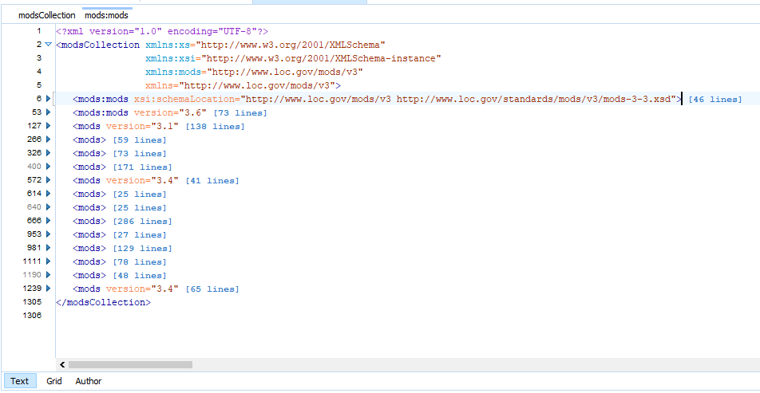
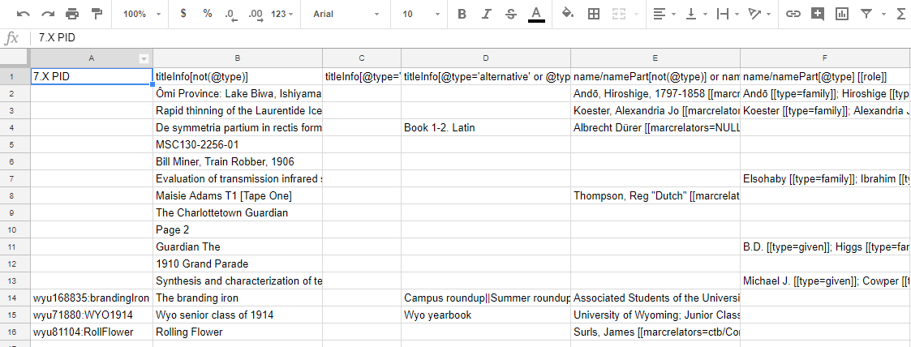
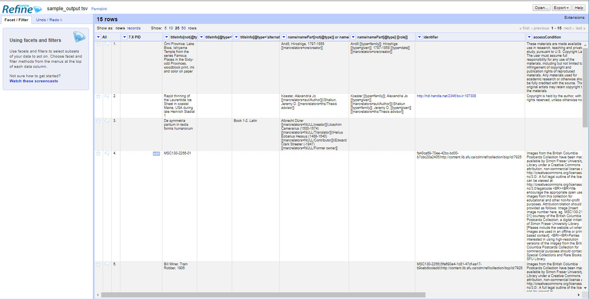

# XML to CSV

## Overview

This repository includes several XSLT 2.0 stylesheets which combine to convert metadata records in XML format into a CSV / TSV document.

The use case for which this was first developed was the export of MODS records from Islandora (specifically, the Louisiana Digital Library or LDL) and subsequent presentation of the metadata in spreadsheet format for sharing, editing, etc.

Current development is focused on Islandora 7.x to CLAW migration. Based on the [CLAW MIG Spring Prep Mapping spreadsheet](https://docs.google.com/spreadsheets/d/18u2qFJ014IIxlVpM3JXfDEFccwBZcoFsjbBGpvL0jJI/edit#gid=0) from the Islandora Metadata Interest Group, this tool uses the _Field Name in Drupal_ values to create column headers, and parses a given set of MODS XML records into a tab-separated table using the _xpath for MODS_ values.

The original "XPaths To CSV" process is a proof of concept only. It represents each unique XPath in the source XML as a separate column in the resulting CSV document. "Unique" here includes not just element names, but also attribute values. These stylesheets are located in the _xpaths_to_csv/_ directory with separate documentation, including instructions and known issues.

### Notes:  

* In spite of the repository name, technically the output of the CLAW-focused branch of this project is in TSV (tab-separated) format. This is due to the higher frequency of commas in metadata fields versus tab characters.
* Either XML editing/debugging software such as Oxygen or a command-line XSLT processor such as Saxon is required to run the transforms. Refer to the section on [Notes on Processing with Saxon](#notes-on-processing-with-saxon), below.

## Process

General workflow is to:
1. [Export/prepare source XML metadata](#1-prepare-a-single-source-mods-xml-document)
1. [Build a TSV file by evaluating the source metadata document against the field list](#2-build-a-tsv-file-of-the-metadata-evaluated-against-the-list-of-fields)
1. [Use the output for automated and/or manual metadata reconciliation](#3-use-the-output-for-metadata-review-and-reconciliation)

### 1. Prepare a single source MODS XML document

**For exporting MODS XML records from Islandora 7.X**, we recommend [Islandora Datastream CRUD](https://github.com/SFULibrary/islandora_datastream_crud). This utility will produce one MODS XML file per PID.

Merge the multiple MODS XML files into a single "MODS Collection" XML file with a `<modsCollection>` root element using **mods_xml_merge.xsl**.
* _Usage:_ With the location of the XML files as the _directoryName_ parameter and the XSLT file itself as the source, run **mods_xml_merge.xsl** in Oxygen, or at the command line with Saxon:
  * `java -jar saxon9he.jar -s:mods_xml_merge.xsl -xsl:mods_xml_merge.xsl -o:MIG_sample_data/sample_mods.xml directoryName=MIG_sample_data/input_directory/`  
  * The input directory (with its path) is passed in as the 'directoryName' parameter, INCLUDING the trailing slash.  
* This stylesheet also adds an `<identifier>` element to each MODS record, with the item's PID as its value, derived from the MODS XML filename as formatted by the Islandora Datastream CRUD output.

### 2. Build a TSV file of the metadata evaluated against the list of fields

The _Field Name in Drupal_ from the [CLAW MIG Spring Prep Mapping spreadsheet](https://docs.google.com/spreadsheets/d/18u2qFJ014IIxlVpM3JXfDEFccwBZcoFsjbBGpvL0jJI/edit#gid=0) will be the column headers. There will be one row of data per metadata record. MODS elements that are not explicitly mapped in this spreadsheet will not be included in the output.

* _Usage:_ With the single MODS XML document as the source, run **claw_fields_tsv_maker.xsl** in Oxygen, or at the command line with Saxon:
  * `java -jar saxon9he.jar -s:MIG_sample_data/sample_mods.xml -xsl:claw_fields_tsv_maker.xsl -o:MIG_sample_data/sample_output.tsv`

The resulting TSV file can be opened and edited with a regular spreadsheet-viewing application.

### 3. Use the output for metadata cleanup and reconciliation

Review, cleanup, and reconciliation is up to the user. For some purposes, a spreadsheet application may be sufficient.

The CLAW Migration participants are interested in the application of [OpenRefine](http://openrefine.org/). To create an OpenRefine project based on the TSV output, use the following settings:
* Select the TSV output file
* For 'Parse the data as' select 'CSV / TSV / separator-based files'
* For 'Character encoding' use 'UTF-8'
* For 'Columns are separated by' select 'tabs (TSV)'
* Leave checked 'Parse next 1 line(s) as column headers'
* **Uncheck 'Quotation marks are used to enclose cells containing column separators'**
* Leave checked 'Store blank rows' and 'Store blank cells as nulls'

## Known Issues & Intended Improvements

* 'Agent' fields / name/* elements need additional logic
* Handling of empty elements (extra/leading/trailing delimiters in cells)
* Handling of values stored in attributes instead of as text nodes
* Develop additional stylesheet to identify XPaths in metadata set that are *not* included in output

## Notes on Processing with Saxon

First, be sure to have downloaded Saxon to your local machine. The example commands here (copied from above) assume that it is available from the root of the directory created when you clone this repository. If you downloaded it here, great! Otherwise, it may be useful to make a symbolic link/shortcut from the downloaded unzipped .jar location (shown as /opt/saxon) to this directory, as shown in the first step:

* `ln -s /opt/saxon/saxon9he.jar saxon9he.jar`
* `java -jar saxon9he.jar -s:mods_xml_merge.xsl -xsl:mods_xml_merge.xsl -o:sample_data/sample_mods.xml directoryName=sample_data/input_directory/`
 * `java -jar saxon9he.jar -s:sample_data/sample_mods.xml -xsl:xpath_list.xsl -o:sample_data/sample_xpaths.xml`
 * `java -jar saxon9he.jar -s:sample_data/sample_xpaths.xml -xsl:field_list.xsl -o:sample_data/sample_fields.xml`
 * `java -jar saxon9he.jar -s:sample_data/sample_mods.xml -xsl:csv_maker.xsl -o:sample_data/sample_csv.csv headerFile=sample_data/sample_fields.xml`

Saxon HE is on SourceForge, somewhere like this: https://sourceforge.net/projects/saxon/files/Saxon-HE/9.8/
